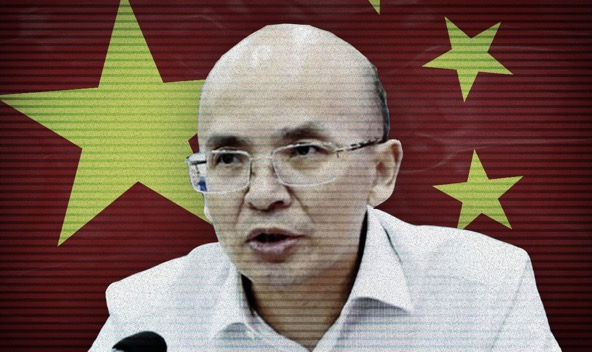

**Chen Anlin**

China CN

  

陈安林

**Year of birth:** 1964

**Application approved**: 03.07.2018

**Estimated net worth** $57.9m

**Info:** A member of the CPPCC National Committee of Huangpi District, Chen is also a director of a subsidiary of the state-owned enterprise, China Energy Conservation and Environmental Protection Group (CECEP).

**Related applicants:** Chen's wife also acquired Cypriot citizenship. The couple are not investors but obtained passports through their son, Yao Chen, who became a Cypriot citizen on July 27, 2017.

Second citizenships are not allowed under Chinese law and can result in the automatic loss of Chinese citizenship. 

**出生年月：** 1964

**申请批准日期：** 03.07.2018

**估计净值** 5790万美元

**信息：** 陈安林是中国湖北省武汉市黄陂区政协委员，也是国有企业中国节能环保集团（CECEP）的董事

**相关申请人：** 陈安林的妻子也获得了塞浦路斯公民身份。 这对夫妇并不是投资者，而是通过他们的儿子姚晨（Yao Chen 音译）获得了护照。姚晨（Yao Chen 音译）于2017年7月27日成为塞浦路斯公民

根据中国法律，第二公民身份是不允许的，并且会导致中国公民身份自动丧失

[VIEW SOURCE DOCUMENTS](ZH-01-Chen-Anlin.pdf)

## 人物介绍

###百度百科

- 由于半岛电视台对**塞浦路斯黄金护照**的曝光，百度百科[历史版本](https://baike.baidu.com/historylist/%E9%99%88%E5%AE%89%E6%9E%97/6709183)中，在2020-08-31刻意去掉了**黄陂区政协委员**。

- 2020-08-30的版本：[百度百科](https://baike.baidu.com/history/%E9%99%88%E5%AE%89%E6%9E%97/6709183/152779406)、[永久记录 Archive.org](https://web.archive.org/save/https://baike.baidu.com/history/%E9%99%88%E5%AE%89%E6%9E%97/6709183/152779406)

- 创建版本：[百度百科](https://baike.baidu.com/history/%E9%99%88%E5%AE%89%E6%9E%97/6709183/31349454)、[永久记录 Archive.org](https://web.archive.org/save/https://baike.baidu.com/history/%E9%99%88%E5%AE%89%E6%9E%97/6709183/31349454)

### 媒体报道

[河南能源与湖北恒泰天纵控股集团签署股权债权转让协议](https://app.dahecube.com/mobile/clfnews/20190904/20190904200420584945?news_id=45310)、[永久记录 Archive.org](https://web.archive.org/save/https://app.dahecube.com/mobile/clfnews/20190904/20190904200420584945?news_id=45310)

### 企业查询

[企查查](https://www.qcc.com/firm/7b05c7627d7467b21fe51b000226fffd.html)、[永久记录 Archive.org](https://web.archive.org/web/20201015013024/https://www.qcc.com/firm/7b05c7627d7467b21fe51b000226fffd.html)