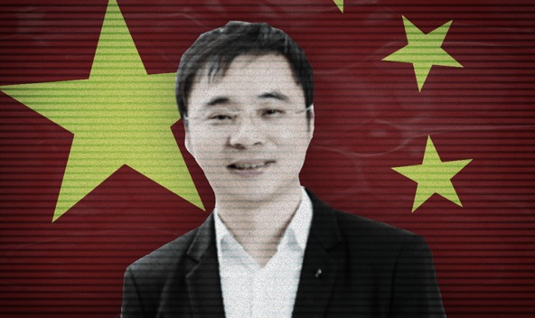

**Fu Zhengjun**

China CN

  

傅政军

**Year of birth:** 1978

**Application approved**: 08.11.2017 

**Info:** Fu's companies include WEEK8 HOLDINGS (HK) LIMITED and Tian Ge Interactive Holdings Limited, a social media platform.

He also holds political office as vice-chairman of the presidium of Zhejiang Province Zheshang Economic Development Center and formerly as Member of the 6th Jinhua Municipal Committee of the CPPCC (2011-2017). 

**Related applicants:** Fu's wife also acquired a Cypriot passport.

Second citizenships are not allowed under Chinese law and can result in the automatic loss of Chinese citizenship.  

[VIEW SOURCE DOCUMENTS](ZH-02-Fu-Zhengjun.pdf)

**出生年月：** 1978

**已批准申请**：08.11.2017

**信息：**傅政军的公司包括星期八控股香港有限公司(WEEK8 HOLDINGS（HK）LIMITED)和社交媒体平台天鸽互动控股有限公司(Tian Ge Interactive Holdings Limited)

他还曾担任浙江省浙商经济发展中心主席团副主席，前政协金华市第六届委员会委员（2011-2017年）

**相关申请人：**傅政军的妻子也获得了塞浦路斯护照

根据中国法律，第二公民身份是不允许的，并且会导致中国公民身份自动丧失