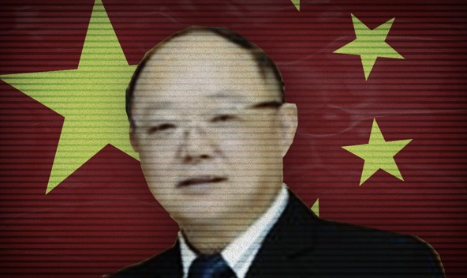

**Lu Wenbin**

China CN

  

陆文斌

**Year of birth:** 1964

**Application approved**: 24.07.2019 

**Info:** Lu is a local political representative as deputy to the 17th Chengdu People's Congress. Cyprus' new rules banning PEPs from the golden passport scheme were just weeks away from coming into force by the time his passport was approved. 

**Related applicants:** Lu's wife also acquired a Cypriot passport.

Second citizenships are not allowed under Chinese law and can result in the automatic loss of Chinese citizenship. 

[VIEW SOURCE DOCUMENTS](ZH-05-Lu-Wenbin-Collective.pdf)

**出生年月：** 1964

**已批准申请**：24.07.2019

**信息：** 陆文斌是第十七届成都人大代表的地方政治代表。 在其获得批准后数周后，塞浦路斯出台了新的禁止PEPs进入黄金护照计划的规定

**相关申请人：** 陆文斌的妻子也获得了塞浦路斯护照

根据中国法律，第二公民身份是不允许的，并且会导致中国公民身份自动丧失