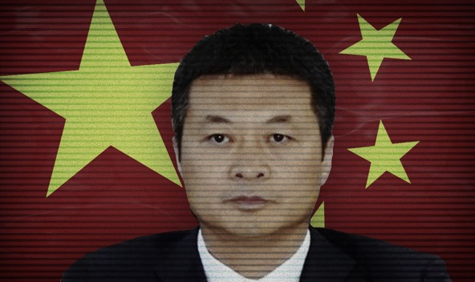

**Tang Yong**

China CN

 

唐勇

**Year of birth:** 1972

**Application approved**: 21.01.2019

**Info:** President and executive director of China Resources Power Holding, a subsidiary of China Resources Holdings, a Chinese state-owned conglomerate that owns a variety of businesses in Hong Kong and mainland China. It was ranked 80th on the 2019 Fortune Global 500 list, with revenue of $91bn (2019).

Second citizenships are not allowed under Chinese law and can result in the automatic loss of Chinese citizenship.   

**VIEW SOURCE DOCUMENTS**： 404 Not Found

**出生年月：** 1972

**已批准申请**：21.01.2019

**信息：**华润电力控股有限公司（China Resources Power Holding）的总裁兼执行董事。华润电力控股有限公司是中国国有企业集团，在香港和中国内地拥有多种业务。 它在2019年《财富》全球500强排名中排名第80位，收入910亿美元（2019年）

根据中国法律，第二公民身份是不允许的，并且会导致中国公民身份自动丧失