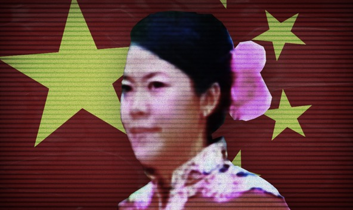

**Yang Huiyan**

China CN

   

杨惠妍

**Year of birth:** 1981

**Application date:** 23.10.2018

**Estimated net worth** $27bn

**Info:** Billionaire businesswoman and the richest woman in Asia. Yang is the majority shareholder of property developer Country Garden Holdings, a stake largely transferred to her by her father, Yeung Kwok Keung, in 2007. He is also a member of The Chinese People's Political Consultative Conference (CCPPCC), an advisory body to the government. 

**Related applicants:** Yang's husband, Chen Chong, also acquired a Cypriot passport. He is a member of the 12th Guangdong Provincial Committee of the Chinese People’s Political Consultative Conference.

Second citizenships are not allowed under Chinese law and can result in the automatic loss of Chinese citizenship. 

[VIEW SOURCE DOCUMENTS](ZH-06-Yang-Huiyan.pdf)

**出生年月：** 1981

**申请日期：** 2018年10月23日

**估计净资产** 270亿美元

**信息：** 亿万富翁女商人和亚洲首富。 杨惠妍是房地产开发商碧桂园控股有限公司的大股东，该股份由她的父亲杨国强于2007年大部分转让给她。他还是中国人民政治协商会议（CCPPCC）的成员，该委员会是政府的咨询机构

**相关申请人： ** 杨的丈夫陈冲（Chen Chong 音译）也获得了塞浦路斯护照。 他是中国人民政治协商会议第十二届广东省委员会委员

根据中国法律，第二公民身份是不允许的，并且会导致中国公民身份自动丧失
