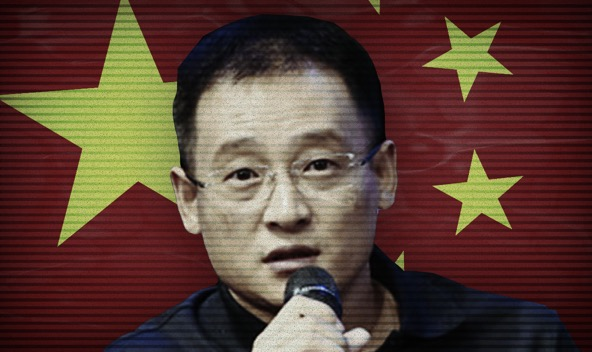

**Zhao Zhenpeng**

China CN

  

赵振鹏

**Year of birth:** 1981

**Application approved**: 12.02.2019  

**Info:** Member of the Binzhou Municipal Committee of the Chinese People's Political Consultative Conference (CPPCC), an advisory body to the government.

Zhao is chairman and the legal representative of Wuyi Yongli Salt Industry Co., Ltd.

**Related applicants:** Zhao's wife also acquired a Cypriot passport.

Second citizenships are not allowed under Chinese law and can result in the automatic loss of Chinese citizenship.   

[VIEW SOURCE DOCUMENTS](ZH-03-Zhao-Zhenpeng.pdf)

**出生年月：** 1981

**已批准申请**：12.02.2019

**信息：** 中国人民政治协商会议（CPPCC）滨州市委员会委员，这是政府的咨询机构

赵振鹏是无棣永利盐业有限公司董事长兼法人代表

**相关申请人：** 赵的妻子也获得了塞浦路斯护照

根据中国法律，第二公民身份是不允许的，并且会导致中国公民身份自动丧失